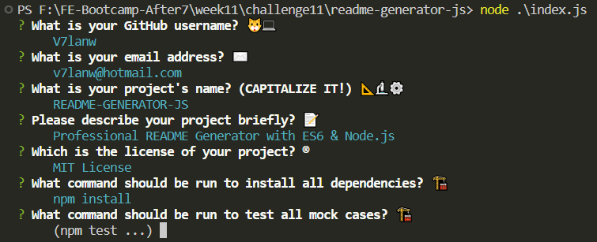

# README-GENERATOR-JS


## Description

Professional README Generator with ES6 & Node.js

### Table of Contents

- [README-GENERATOR-JS](#readme-generator-js)
  - [Description](#description)
    - [Table of Contents](#table-of-contents)
  - [Installation](#installation)
  - [Usage](#usage)
  - [License](#license)
  - [Contributions](#contributions)
  - [Tests](#tests)
  - [Questions](#questions)

## Installation

To install necessary dependencies, run the following command:

``` bash
npm install
```

## Usage

This project is about ...
To run it, install dependencies first with `npm install` ...
then type

``` bash
node ./index.js
```

and follow the steps in CLI:

1. Fill in GitHub user name, then press `enter` to decide.
   
2. Fill in your work mail, then press `enter` to decide.
   
3. Fill in CAPITALIZED PROJECT TITLE! Press `enter` to decide.
   
4. Fill in project description, then press `enter` to decide.
   
5. Choose your project license using 🔼🔽 and then press `enter` to decide.
   
6. Fill in commands of installation, then press `enter` to decide.
   
   I prefer to just insert one command, and then modify this part in a normal editor, and my program is really awkward in multiline editing.
   
   (These steps are edited in VS Code, I know others like Vim or Emacs, but I am not able to plug those CLI editor into my program now, sorry.)
7. Fill in commands of testing cases, then press `enter` to decide.
   
   You may noticed that some prompts are given after questions, you can press `enter` directly to use those contents, but now we just type `npm test` because `...` makes no sense here.
8. Fill in something to introduce your project and how your code makes life easier.
   
   I offered a multiline template, just press `enter` to use this template, or if you have better ideas, modify the project code, don't waste time on teaching command line correctly passing your multiline input, it is not ChatGPT, it is just a dumb program.
9. Fill in something to introduce your future development plan.
   
   Here I will show how dumb it is in passing multiline input.
   
   It is actually 2-line input, `\n` is line break, additional `\` is used to make sure `\n` is parsed correctly.
   
   This is a big object which will be used to generate the README file, you could see the 2-line input is still displayed in one line, I said it is dumb now 😅 .
   
   This is freshly baked README file, and you could see the issues here, wavy underline part is issue detected by markdownlint, and 2-line input is still in one line...
   Yes, we need manually modify README to satisfy our own need, you know McDonalds and KFC can fill the belly, like this program can fill the templates. The next step is take your lunch bag and walk to nearby park and sit on a bench, to fill your eyes with scenes, to fill your mind with ease, as well as fill your belly.
   And I won't post step9-5 picture here, because what you looked is it.

## License

MIT License

- [Commercial use](https://choosealicense.com/appendix/#commercial-use): 🟢 The licensed material and derivatives may be used for commercial purposes.
- [Distribution](https://choosealicense.com/appendix/#distribution): 🟢 The licensed material may be distributed.
- [Modification](https://choosealicense.com/appendix/#modifications): 🟢 The licensed material may be modified.
- [Private use](https://choosealicense.com/appendix/#private-use): 🟢 The licensed material may be used and modified in private.
- [License and copyright notice](https://choosealicense.com/appendix/#include-copyright): 🔵 A copy of the license and copyright notice must be included with the licensed material.
- [Liability](https://choosealicense.com/appendix/#liability): 🔴 This license includes a limitation of liability.
- [Warranty](https://choosealicense.com/appendix/#warranty): 🔴 This license explicitly states that it does NOT provide any warranty.

## Contributions

future development plan:

1. follow airbnb style to refactor this project.
2. multiline input support.
3. vim plug-in? If I can.

Welcome to Pull Request on GitHub!

## Tests

To test all cases, run the following command:

``` bash
npm test
```

## Questions

If you have any questions about the repo, open an issue or contact me directly (v7lanw@hotmail.com).

You can find more of my work at [V7lanw's niches](https://github.com/V7lanw?tab=repositories).
